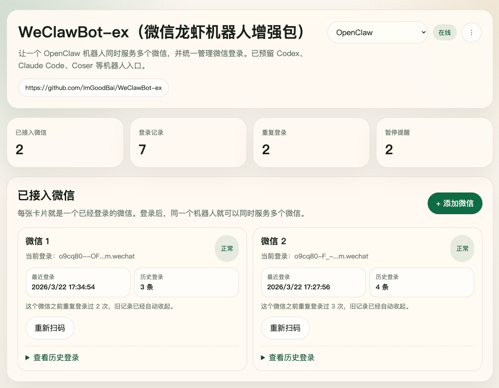
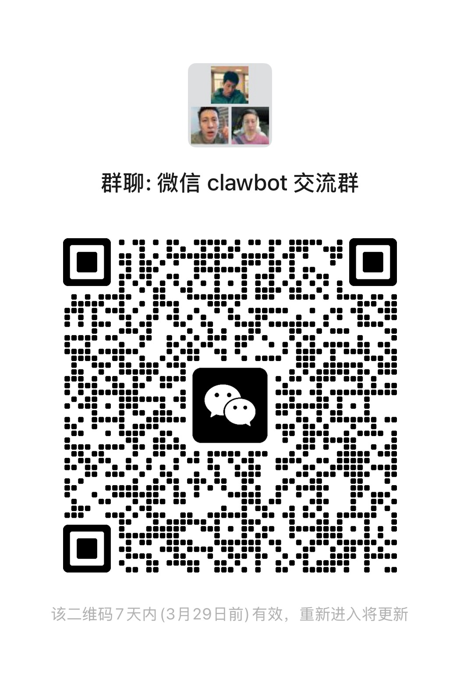

# WeClawBot-ex

[简体中文](./README.zh_CN.md)

Multi-account extension for **WeChat ClawBot** (the official WeChat AI bot plugin by Tencent).

The official ClawBot only supports one QR code and one user at a time. **WeClawBot-ex removes this limit** — multiple WeChat accounts can scan, log in, and chat with your AI agent simultaneously, all managed through a local web console.

## What This Adds Over the Official ClawBot

| | Official ClawBot | WeClawBot-ex |
|---|---|---|
| Concurrent accounts | 1 | Unlimited |
| QR code management | CLI only | Local web console |
| Channel status overview | None | Dashboard with live stats |
| Cooldown diagnostics | None | `-14` errcode visibility |
| Session isolation | Shared | Per-account-per-user |

## Console Preview



## Quick Start

### Prerequisites

- Node.js >= 22
- [OpenClaw](https://docs.openclaw.ai/install) installed (`openclaw` CLI available)

### Install

```bash
git clone https://github.com/ImGoodBai/WeClawBot-ex.git
cd WeClawBot-ex
openclaw plugins install .
```

### Naming

For compatibility, the current release still uses these runtime identifiers:

- Product / repo name: `WeClawBot-ex`
- Plugin package + plugin entry key: `molthuman-oc-plugin-wx`
- Channel config key: `channels.openclaw-weixin`

This is expected for the current version. A mixed-name log does not mean the wrong repository was installed.

### Configure

Add to your OpenClaw config (`openclaw config edit`):

```json
{
  "session": {
    "dmScope": "per-account-channel-peer"
  },
  "plugins": {
    "entries": {
      "molthuman-oc-plugin-wx": {
        "enabled": true,
        "package": "molthuman-oc-plugin-wx"
      }
    }
  },
  "channels": {
    "openclaw-weixin": {
      "baseUrl": "https://ilinkai.weixin.qq.com",
      "demoService": {
        "enabled": true,
        "port": 19120
      }
    }
  }
}
```

### Use

1. Start your OpenClaw Gateway
2. Open **http://127.0.0.1:19120/**
3. Click **Add WeChat Channel** — scan the QR code with WeChat
4. After scan success, wait a few seconds for auto refresh
5. If the new account still does not come online, run `openclaw gateway restart`
6. Send a message from that WeChat account — your AI agent replies

Repeat step 3 for each additional WeChat account.

## Troubleshooting

- `WARNING: Plugin "... contains dangerous code patterns"` is currently warn-only in OpenClaw. It is a scanner warning, not the install blocker.
- `npm install failed` needs the full npm stderr before the root cause can be confirmed.
- Check `node -v` first. This plugin requires Node.js `>= 22`.
- Check `openclaw --version` next. Older OpenClaw builds may be incompatible with this plugin revision.
- If the plugin installs but the console does not open, verify `channels.openclaw-weixin.demoService.enabled=true` and restart Gateway.
- If QR login succeeds but the new account does not receive messages, first wait for auto refresh, then use the manual restart command shown in the diagnostics panel.

## How It Works

```
WeChat User A ──┐
WeChat User B ──┤──> WeClawBot-ex (multi-account plugin)
WeChat User C ──┘         |
                          |──> OpenClaw Agent
                          |         |
                          └──< Reply to each WeChat user
```

- Fork of the official `@tencent-weixin/openclaw-weixin` plugin (v1.0.2)
- Extends the QR login module to support concurrent multi-session management
- Adds a local web console (`src/service/`) for visual channel management
- Each WeChat account gets isolated DM sessions — no cross-talk

## Maintenance Boundary

- The upstream protocol/runtime layer is treated as frozen
- Ongoing changes should stay in our own layer: `src/service/`, plugin packaging, and docs
- Avoid editing upstream-derived files unless a compatibility fix is unavoidable

## Roadmap

- [ ] Group chat (@bot mode)
- [ ] Media message support (images, files, voice)
- [ ] Precise account hot-start without channel-level reload
- [ ] Shareable QR codes for external distribution

## License

MIT — see [LICENSE](./LICENSE) and [NOTICE](./NOTICE) for upstream attribution.

## WeChat Group

Scan the QR code below to join the WeChat ClawBot exchange group:


